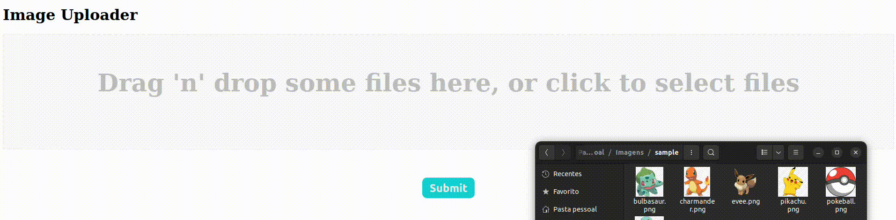

# Drag n Drop File Uploader

> # Description 

## Image Uploads with Flexible File Type Support

This React component, built with react-dropzone, simplifies uploading multiple images. Users can drag-and-drop or select images from their file system. However, the component's flexibility extends beyond images!

 Key Features:

- Intuitive Drag-and-Drop: Effortlessly upload files by dragging them directly into the designated area.
- Multiple File Selection: Choose multiple images at once for efficient uploads.
- Live Image Previews: Gain immediate visual confirmation of the images you're selecting.
- Flexible File Removal: Easily remove individual images before submitting the upload.
- Customizable Submission: Pass a custom submit function as a prop for tailored upload handling.
- Type Safety with TypeScript: Benefit from strong typing for a more robust and maintainable codebase.
- Styled with Styled-Components: Enjoy clean and maintainable styling for a polished user interface.
- Configurable File Types: The accept prop allows you to specify accepted file types (e.g., .jpg, .png). By default, images are supported, but you can easily customize it to accept other file types using the acceptKey prop.

Benefits:
- Improved User Experience: Streamline image uploads compared to traditional methods.
- Increased Efficiency: Support for multiple image selection and drag-and-drop saves time.
- Enhanced Developer Experience: TypeScript ensures code quality and maintainability.
- Easy Customization: Adapt the component's behavior and appearance to your specific needs.

This project is a great starting point for anyone looking to integrate a user-friendly and efficient image upload solution into their React application.

Available here: [Multiple Files Uploader - Vítor F. Nery](https://file-uploader-dropzone-vitorfnery.netlify.app/)

## 🛠️ Technologies 

- React
- TypeScript
- Styled Components
- [react-dropzone](https://react-dropzone.js.org/)
- Git and Github
